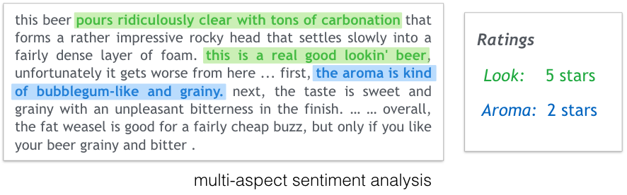
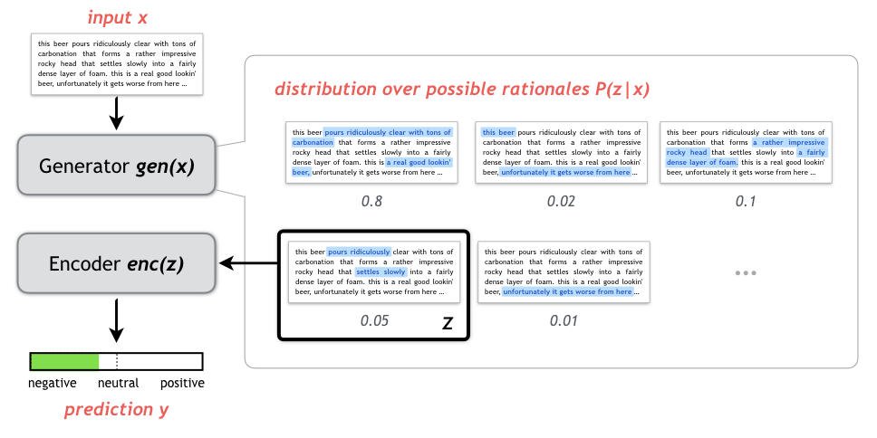

This is a fork of https://github.com/taolei87/rcnn containing all code and data for

Carton, Samuel, Qiaozhu Mei, and Paul Resnick. "Extractive Adversarial Networks: High-Recall Explanations for Identifying Personal Attacks in Social Media Posts." EMNLP (2018).

Available at https://arxiv.org/abs/1809.01499

Which extends the model presented in

Lei, Tao, Regina Barzilay, and Tommi Jaakkola. "Rationalizing neural predictions." EMNLP (2016).

All code and data pertaining to my project can be found in the deliberativeness directory. Everything else is mostly directly transferred over from the original project.

--

First you need to download and process the data. We use the "personal attack" dimension of the dataset presented in

Wulczyn, Ellery, Nithum Thain, and Lucas Dixon. "Ex machina: Personal attacks seen at scale." Proceedings of the 26th International Conference on World Wide Web. International World Wide Web Conferences Steering Committee, 2017.

Available for download at: https://figshare.com/articles/Wikipedia_Talk_Labels_Personal_Attacks/4054689

Download the attack_annotated_comments.tsv and attack_annotations.tsv into deliberativeness/data/raw/wiki/personal_attacks, then run deliberativeness/pycode/processing/wiki2csv.py to write a set of processed CSVs into deliberativeness/data/processed/wiki/personal_attacks

--

To run a pretrained model on this dataset, you will want to first add the root directory and the deliberativeness/pycode directory to your PYTHONPATH then navigate to deliberativeness/pycode/modeling and run:

python train_and_evaluate_models [session_name] [parameter_file]

Where session_name is a short description of this run (e.g. testing_best_emnlp_model) and parameter_file is the name of a paramater file in deliberativeness/pycode/modeling/training_params. Output from the code, including a trained model, an annotated data CSV, and a copy of the command-line output of the script, will be written to deliberativeness/output/training_output/.output/[session_name].

To use this code on your own data you should take a look at how the data in deliberativeness/data/processed/wiki/personal_attacks is structured, and how parameter files such as deliberativeness/pycode/modeling/training_params/best_emnlp_model.py are structured. This should make it fairly clear how to use your own data and parameter sets.

--

We also include a slightly-altered copy of the LIME code described in

Ribeiro, Marco Tulio, Sameer Singh, and Carlos Guestrin. "Why should i trust you?: Explaining the predictions of any classifier." Proceedings of the 22nd ACM SIGKDD international conference on knowledge discovery and data mining. ACM, 2016.

Available at https://github.com/marcotcr/lime

--

External packages used include:
Theano 0.9.0
scikit-learn 0.18.1
word2vec 0.9.1
numpy 1.13.1
pandas 0.18.1
nltk 3.2.1
intervaltree 2.1.0
beautifulsoup4 4.4.1

--

Email scarton@umich.edu if you have any questions

### Original readme:

### Latest updates
Check [code/rationale](/code/rationale) for the project of learning rationales for neural prediction:  

 &nbsp; &nbsp; &nbsp; &nbsp; 

-------

#### About this repo
This repo contains Theano implementations of popular neural network components and optimization methods. Source code of the following papers are also available:

  [1] [Molding CNNs for text: non-linear, non-consecutive convolutions](http://arxiv.org/abs/1508.04112). EMNLP 2015
  
  [2] [Semi-supervised Question Retrieval with Gated Convolutions](http://arxiv.org/abs/1512.05726). NAACL 2016

  [3] [Rationalizing Neural Predictions](https://people.csail.mit.edu/taolei/papers/emnlp16_rationale.pdf). EMNLP 2016

#### Features
  - Basic modules including feedforward layer, dropout, word embedding, RNN, LSTM, GRU and CNN
  - Optimization methods including SGD, AdaGrad, AdaDelta and Adam
  - Advanced modules from recent papers such as attention and gated convolution.
  - Transparent to use GPU

-------

#### Projects

###### 1. Neural question retrieval for community-based QA

The directories [code/qa](/code/qa) and [code/pt](/code/pt) contain the implementation of the model described in paper [[2]](http://arxiv.org/abs/1512.05726). Datasets and and pre-trained word vectors are available at [here](https://github.com/taolei87/askubuntu).

###### 2. Sentiment analysis / document classification

The directory [code/sentiment](/code/sentiment) contains the implementation of the model described in paper [[1]](http://arxiv.org/abs/1508.04112). Datasets and and pre-trained word vectors are available at [here](https://github.com/taolei87/text_convnet).

###### 3. Rationalizing neural predictions

The directory [code/rationale](/code/rationale) contains the implementation of the model described in paper [[3]](https://people.csail.mit.edu/taolei/papers/emnlp16_rationale.pdf).

-------

#### Dependencies
  [Theano](http://deeplearning.net/software/theano/) >= 0.7, Python >= 2.7, Numpy

-------
